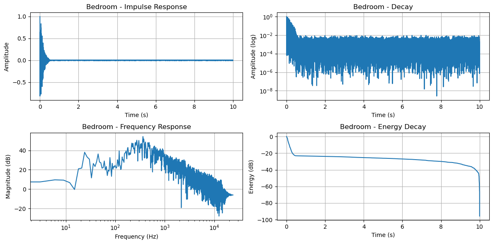
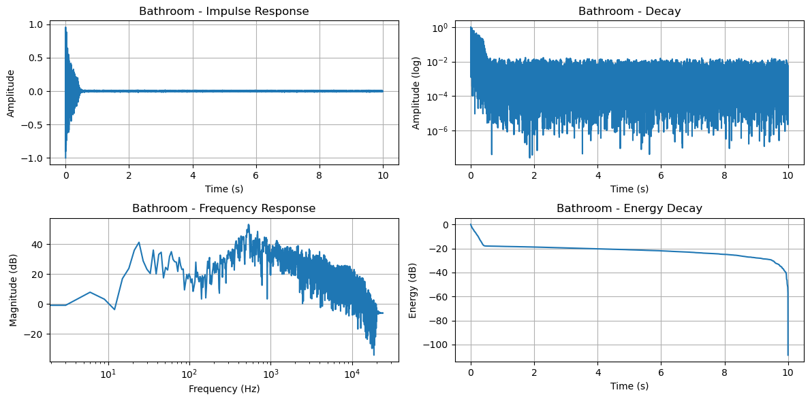

# Audio Convolution Reverb


A native macOS convolution reverb studio with a SwiftUI front end, Swift FFT audio engine, SQLite history database, and the original notebook algorithm preserved as Python source.

## Features

- Generate logarithmic sine sweeps for room recording
- Extract impulse responses from recorded sweeps
- Apply convolution reverb to dry audio
- Mix dry/wet levels, pre-delay, decay shaping, low cut, high cut, reverse bloom, and output normalization
- Create a custom convolution reverb impulse response from duration, decay, tone, and early reflections
- Save presets and render history to a local SQLite database
- Preview dry/rendered/IR audio inside the app with A/B switching
- Visualize waveform, frequency response, energy decay, and input/output levels
- Drag-and-drop WAV, AIFF, CAF, and M4A audio files
- Run as a polished SwiftUI macOS app or from Swift/Python CLIs
- Preserve the original notebook implementation in split Python source files

## Screenshots


## Early Test Results

These two images were extracted from the original notebook and kept as early portfolio output.





## Requirements

### Latest Version

- Apple M chips and Intel processors
- Runtime requirement: macOS 13+
- Xcode 15+ or Swift 5.9+
- Python 3.10+ for the preserved original CLI workflow
- Example audio files are included for demo rendering and impulse-response extraction

## Build

```bash
swift test
```

## Run

Launch the native SwiftUI app:

```bash
swift run "Audio Convolution Reverb"
```

Use the Swift CLI:

Generate a sweep:

```bash
swift run audio-reverb-swift sweep examples/audio/test_sweep.wav 10 48000
```

Extract an impulse response:

```bash
swift run audio-reverb-swift extract-ir examples/audio/bedroom_recorded.wav examples/audio/test_sweep.wav output/bedroom_ir.wav
```

Apply reverb:

```bash
swift run audio-reverb-swift apply examples/audio/dry_piano.wav examples/audio/bedroom_ir.wav output/piano_bedroom_reverb.wav 0.5 0.5
```

Create a custom convolution reverb:

```bash
swift run audio-reverb-swift custom-ir output/custom-ir.wav 2.8 4.2 0.55
```

Convert audio format:

```bash
swift run audio-reverb-swift convert examples/audio/dry_vocal.wav output/dry_vocal.aiff
```

The Python CLI is still available for the original notebook workflow:

```bash
python3 -m venv .venv
source .venv/bin/activate
pip install -e ".[dev]"
audio-reverb demo
```

## Package

```bash
./scripts/package-app.sh
open "dist/Audio Convolution Reverb.app"
```

The app package script creates a universal macOS `.app`, a signed zip archive, and a DMG image.

Python source and wheel artifacts:

```bash
./scripts/package_release.sh
```

## Original Work

The original notebook was split into Python source and early result images. The original function names and formulas are preserved in `src/audio_convolution_reverb/original_notebook.py`:

- `generate_log_sweep`
- `extract_impulse_response`
- `apply_convolution_reverb`
- `analyze_impulse_response`

The Swift app adds a native front end, FFT convolution engine, WAV conversion, custom IR generation, and SQLite-backed history without deleting the original algorithm.

## Data Location

Render history and presets are stored locally at:

```text
~/Library/Application Support/Audio Convolution Reverb/reverb.sqlite
```

## Release

Download v1.0.0 and newer source packages from [GitHub Releases](https://github.com/HanBangyuan8/Audio-Convolution-Reverb/releases).

Release notes are maintained in `CHANGELOG.md`.

## License

MIT License. See [LICENSE](LICENSE).

## Star History

<a href="https://www.star-history.com/?type=date&repos=HanBangyuan8%2FAudio-Convolution-Reverb">
 <picture>
   <source media="(prefers-color-scheme: dark)" srcset="https://api.star-history.com/chart?repos=HanBangyuan8/Audio-Convolution-Reverb&type=date&theme=dark&legend=top-left" />
   <source media="(prefers-color-scheme: light)" srcset="https://api.star-history.com/chart?repos=HanBangyuan8/Audio-Convolution-Reverb&type=date&legend=top-left" />
   
 </picture>
</a>
